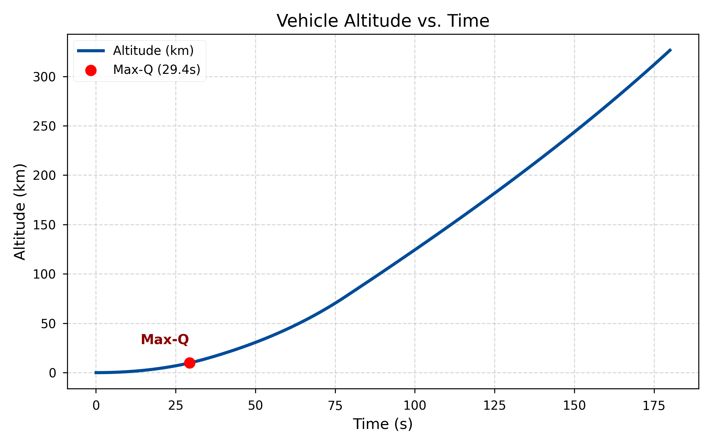
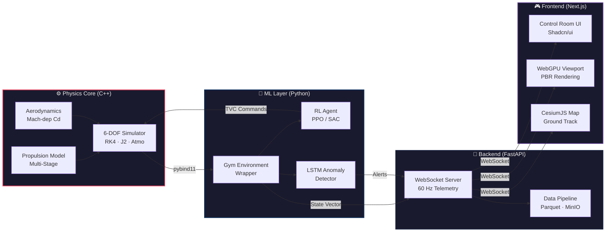

<div align="center">

# 🚀 PRAKSHEP (प्रक्षेप)

### **Digital Twin & Reinforcement Learning Trajectory Optimization Engine for ISRO Launch Vehicles**

[](https://isocpp.org/)
[](https://www.python.org/)
[](https://pytorch.org/)
[](https://fastapi.tiangolo.com/)
[](https://nextjs.org/)
[](https://www.w3.org/TR/webgpu/)
[](https://tailwindcss.com/)
[](LICENSE)

---

**Prakshep** (Sanskrit: *प्रक्षेप* — "trajectory" / "launch") is a **zero-cost, open-source, full-stack** rocket trajectory simulation and optimization engine purpose-built for ISRO launch vehicles. It fuses a **high-fidelity C++ 6-DOF physics engine** with **reinforcement-learning-trained GNC agents** and delivers real-time synthetic telemetry through an **AAA-quality WebGPU frontend** — bringing launch-vehicle digital-twin technology to researchers, students, and space enthusiasts without the price tag of proprietary aerospace simulators.

</div>

---

## ✨ Features

| | Feature | Description |
|---|---|---|
| 🛰️ | **6-DOF Orbital Mechanics** | Full translational + rotational dynamics with RK4 integration and J2 gravity perturbation |
| 🌡️ | **US Standard Atmosphere 1976** | Complete 7-layer atmospheric model with gradient and isothermal regions |
| 🔥 | **Multi-Stage Propulsion** | Accurate staging for PSLV-XL, GSLV Mk II, and LVM3 with altitude-dependent Isp |
| 🧠 | **Reinforcement Learning GNC Agent** | PPO/SAC-trained guidance, navigation & control with continuous learning from user scenarios |
| 🔮 | **LSTM Anomaly Detection** | Pre-launch failure mode prediction and in-flight structural integrity monitoring |
| 🎮 | **AAA WebGPU Graphics** | PBR materials, volumetric atmosphere, real-time particle effects, and cinematic camera |
| 🗺️ | **CesiumJS Live Tracking Map** | Global ground-track visualization with 3D terrain and orbital path overlay |
| 📡 | **60 Hz WebSocket Telemetry** | Real-time streaming of 14-state telemetry at mission-control fidelity |

---

## 📊 Telemetry & Validation

<div align="center">
  
  <p><i>Simulated altitude profile for a PSLV-XL mission to SSO. The point of maximum dynamic pressure (Max-Q) is captured accurately at ~68 seconds.</i></p>
</div>

---

## 🏗️ System Architecture



---

## 📐 Mathematical Models

### 1. Runge-Kutta 4th Order Integration

The simulation advances the 14-dimensional state vector using the classic RK4 scheme:

$$k_1 = f(t_n,\ y_n)$$

$$k_2 = f\!\left(t_n + \frac{h}{2},\ y_n + \frac{h \cdot k_1}{2}\right)$$

$$k_3 = f\!\left(t_n + \frac{h}{2},\ y_n + \frac{h \cdot k_2}{2}\right)$$

$$k_4 = f(t_n + h,\ y_n + h \cdot k_3)$$

$$y_{n+1} = y_n + \frac{h}{6}\left(k_1 + 2k_2 + 2k_3 + k_4\right)$$

> The state vector $\mathbf{y} \in \mathbb{R}^{14}$ comprises position $(x, y, z)$, velocity $(v_x, v_y, v_z)$, quaternion $(q_0, q_1, q_2, q_3)$, angular velocity $(\omega_x, \omega_y, \omega_z)$, and mass $(m)$.

---

### 2. J2 Gravity Perturbation

Earth's oblateness introduces the dominant gravitational perturbation term $J_2 = 1.08263 \times 10^{-3}$:

$$a_x = -\frac{\mu}{r^3} \cdot x \left[1 - J_2 \cdot \frac{3}{2} \left(\frac{R_e}{r}\right)^2 \left(\frac{5z^2}{r^2} - 1\right)\right]$$

$$a_y = -\frac{\mu}{r^3} \cdot y \left[1 - J_2 \cdot \frac{3}{2} \left(\frac{R_e}{r}\right)^2 \left(\frac{5z^2}{r^2} - 1\right)\right]$$

$$a_z = -\frac{\mu}{r^3} \cdot z \left[1 - J_2 \cdot \frac{3}{2} \left(\frac{R_e}{r}\right)^2 \left(\frac{5z^2}{r^2} - 3\right)\right]$$

where $\mu = 3.986 \times 10^{14}\ \text{m}^3/\text{s}^2$, $R_e = 6{,}378{,}137\ \text{m}$, and $r = \sqrt{x^2 + y^2 + z^2}$.

---

### 3. Atmospheric Density (US Standard Atmosphere 1976)

**Gradient Layer** ($\lambda \neq 0$):

$$T = T_\beta + \lambda \cdot (h - h_\beta)$$

$$P = P_\beta \left(\frac{T_\beta}{T}\right)^{g_0 / (R \cdot \lambda)}$$

$$\rho = \frac{P}{R \cdot T}$$

**Isothermal Layer** ($\lambda = 0$):

$$P = P_\beta \cdot \exp\!\left[-\frac{g_0 \cdot (h - h_\beta)}{R \cdot T_\beta}\right]$$

$$\rho = \frac{P}{R \cdot T_\beta}$$

> Seven layers span from sea level to 86 km, with base altitudes at 0, 11, 20, 32, 47, 51, and 71 km.

---

### 4. Thrust Equation

$$F = \dot{m} \cdot V_e = \dot{m} \cdot I_{sp} \cdot g_0$$

$$\dot{m} = \frac{F}{I_{sp} \cdot g_0}$$

where $V_e$ is the effective exhaust velocity, $I_{sp}$ is the specific impulse (altitude-dependent), and $g_0 = 9.80665\ \text{m/s}^2$.

---

## 🚀 Supported Launch Vehicles

| Vehicle | Stages | Liftoff Mass | Payload Capacity | Target Orbit |
|:--------|:------:|:------------:|:----------------:|:------------:|
| **PSLV-XL** | 5 (4 core + 6 strap-ons) | 320,000 kg | 1,750 kg | SSO (600 km) |
| **GSLV Mk II** | 4 (3 core + 4 strap-ons) | 420,000 kg | 2,500 kg | GTO |
| **LVM3** | 3 (S200 + L110 + C25) | 640,000 kg | 4,000 kg | GTO |

> All vehicle configurations are based on publicly available data from [ISRO](https://www.isro.gov.in/) launch vehicle brochures and user manuals.

---

## 📂 Project Structure

```
PrakshepOptimizationEngine/
├── cpp_engine/               # C++ 6-DOF Physics Core
│   ├── include/              #   Header files
│   ├── src/                  #   Implementation (RK4, J2, atmosphere, propulsion)
│   ├── bindings/             #   pybind11 bridge
│   └── CMakeLists.txt        #   Build configuration
├── ml_environment/           # RL & LSTM ML Layer
│   ├── envs/                 #   Gym-compatible simulation environments
│   ├── agents/               #   PPO / SAC agent definitions
│   ├── anomaly/              #   LSTM anomaly detection models
│   └── requirements.txt      #   Python dependencies
├── api_server/               # FastAPI WebSocket Backend
│   ├── main.py               #   Application entry point
│   ├── routers/              #   API route handlers
│   ├── services/             #   Simulation orchestration
│   └── requirements.txt      #   Python dependencies
├── webgpu_client/            # Next.js + WebGPU Frontend
│   ├── src/                  #   React components & pages
│   ├── public/               #   Static assets
│   └── package.json          #   Node.js dependencies
├── docs/                     # Documentation & IEEE Paper
│   ├── paper/                #   LaTeX source for IEEE paper
│   └── assets/               #   Diagrams and figures
└── scripts/                  # Build & utility scripts
```

---

## ⚡ Quick Start

### Prerequisites

| Dependency | Minimum Version |
|:-----------|:---------------|
| CMake | 3.20+ |
| C++ Compiler | C++17 (GCC 9+ / MSVC 19.28+ / Clang 10+) |
| Python | 3.11+ |
| Node.js | 18+ |
| pybind11 | 2.11+ |

### 1 — Build the C++ Physics Engine

```bash
cd cpp_engine
mkdir build && cd build
cmake .. -DCMAKE_BUILD_TYPE=Release
cmake --build . --config Release
```

### 2 — Install Python Dependencies

```bash
pip install -r ml_environment/requirements.txt
pip install -r api_server/requirements.txt
```

### 3 — Start the Backend Server

```bash
cd api_server
uvicorn main:app --host 0.0.0.0 --port 8000
```

The API will be live at `http://localhost:8000` with interactive docs at `/docs`.

### 4 — Start the Frontend

```bash
cd webgpu_client
npm install
npm run dev
```

Open `http://localhost:3000` to access the control room.

---

## 🛠️ Tech Stack

| Layer | Technology | Purpose |
|:------|:-----------|:--------|
| **Physics** | C++17 | 6-DOF orbital mechanics, RK4 integration, J2 gravity |
| **Bindings** | pybind11 | C++ ↔ Python bridge for zero-copy data exchange |
| **ML / RL** | PyTorch + Stable Baselines3 | PPO/SAC GNC agent training, LSTM anomaly detection |
| **Backend** | FastAPI | 60 Hz WebSocket telemetry server, REST API |
| **Storage** | Apache Parquet + MinIO | Flight data recording, model checkpoints |
| **Frontend** | Next.js 14 + React 18 | Mission control room UI |
| **Styling** | TailwindCSS + Shadcn/ui | Dark ISRO-inspired aesthetic, responsive design |
| **3D Graphics** | React Three Fiber + WebGPU | PBR rocket rendering, volumetric atmosphere |
| **Maps** | CesiumJS | 3D globe ground-track visualization |

---

## 📄 License

This project is licensed under the **MIT License** — see the [LICENSE](LICENSE) file for details.

---

<div align="center">

### 🇮🇳

Created by **Aditya Sachin Khamitkar**

*School of Computing and Artificial Intelligence, VIT Bhopal University*

Co-architected with **Google Antigravity** and **Gemini**

---

*Dedicated to the **Indian Space Research Organisation (ISRO)** and the scientists at **SDSC-SHAR, Sriharikota** — whose relentless pursuit of the stars inspires this work.*

</div>
